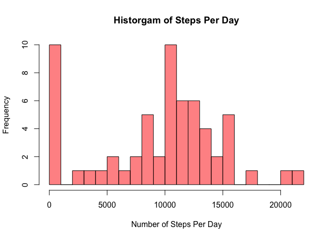
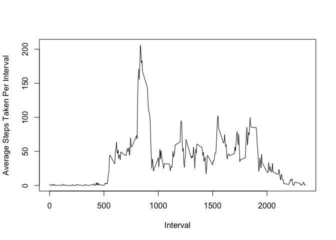
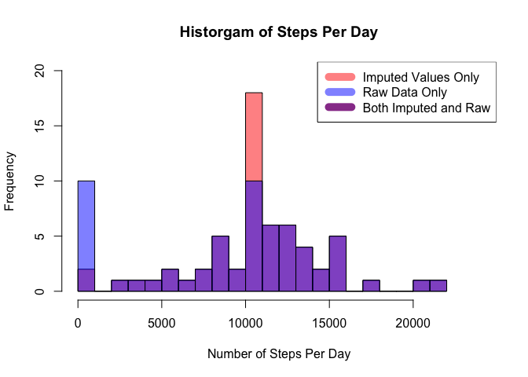
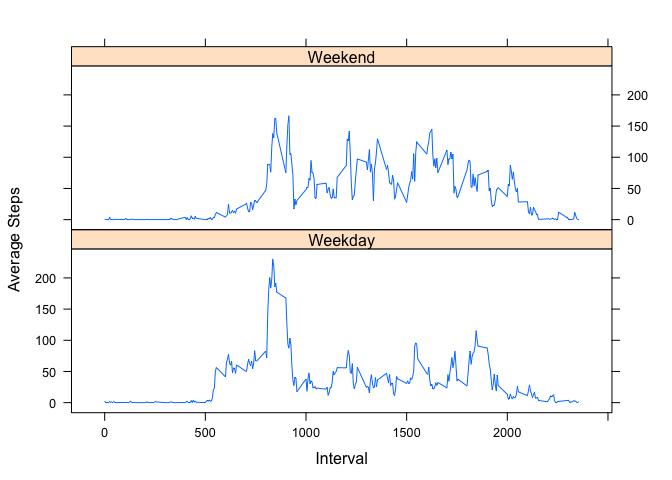

## Loading and preprocessing the data
First thing's first: let's load some data! We're going to first download it from https://d396qusza40orc.cloudfront.net/repdata%2Fdata%2Factivity.zip, then unzip it, and finally we will load it into the variable *activity_data*

```r
download.file("https://d396qusza40orc.cloudfront.net/repdata%2Fdata%2Factivity.zip","data.zip")
unzip("data.zip")
activity_data <- read.csv("activity.csv")
```

## What is mean total number of steps taken per day?
First, let's calculate the total number of steps taken per day. We will use *dplyr* to do this.

```r
library("dplyr")
steps_summary <- activity_data %>% group_by(date) %>% summarize(total_steps=sum(steps, na.rm=TRUE))
```
Next, we will make a histogram of the total number of steps taken each day:

```r
hist(steps_summary$total_steps, breaks=25, col=rgb(1,0,0,0.5), xlab="Number of Steps Per Day", main="Historgam of Steps Per Day")
```

<!-- -->


The mean and median of the total number of steps taken per day can be calculated like this:

```r
mean(steps_summary$total_steps)
```

```
## [1] 9354.23
```

```r
median(steps_summary$total_steps)
```

```
## [1] 10395
```

## What is the average daily activity pattern?

Let's calculate the average number of steps taken within each interval, averaged across all days. We will then plot it as a line graph, like this:

```r
interval_summary <- activity_data %>% group_by(interval) %>% summarize(average_steps=mean(steps, na.rm=TRUE))
plot(y=interval_summary$average_steps, x=
interval_summary$interval, type="l", ylab="Average Steps Taken Per Interval", xlab="Interval")
```

<!-- -->

Which 5-minute interval, on average across all the days in the dataset, contains the maximum number of steps?


```r
interval_summary[which.max(interval_summary$average_steps),1]
```

```
## # A tibble: 1 x 1
##   interval
##      <int>
## 1      835
```

## Imputing missing values
First, let's calculate and report the total number of missing values in the dataset

```r
sum(is.na(activity_data))
```

```
## [1] 2304
```

Now, we will devise a strategy for imputing missing values:
**Stragegy**: replace *NA* with the mean steps for that interval from *interval_summary*

With that strategy, let's create a new dataset that is equal to the original dataset but with the missing data filled in. To do this, we will get an index of all the missing value, make a copy of *activity_data*, which we will call *imp_act_dat*, and then copy the imputed values into that new frame.


```r
na_index <- which(is.na(activity_data$steps))
imp_act_dat  <- activity_data 
imp_act_dat$steps[na_index] <- interval_summary$average_steps[
              match(imp_act_dat$interval[na_index],interval_summary$interval)]
```

*imp_act_dat* now contains our imputed values without any *NA*s:

```r
sum(is.na(imp_act_dat))
```

```
## [1] 0
```

Next, let's make a histogram of the total number of steps taken each day in the imputed data. To facilitate comparison, we will overlay the original data set.

```r
imp_step_sum <- imp_act_dat %>% group_by(date) %>% summarize(tot_step=sum(steps, na.rm=TRUE))   # Compute the steps per day

hist(imp_step_sum$tot_step, breaks=20, col=rgb(1,0,0,0.5), xlab="Number of Steps Per Day", 
     main="Historgam of Steps Per Day", xlim=c(0,24000), ylim=c(0,20))  # Imputed histogram

hist(steps_summary$total_steps, breaks=20, col=rgb(0,0,1,0.5),add=TRUE) # Original histogram

legend("topright", c("Imputed Values Only", "Raw Data Only", "Both Imputed and Raw"),
       col=c(rgb(1,0,0,0.5),rgb(0,0,1,0.5),rgb(0.6,0.25,0.6,1)),lwd=10)
```

<!-- -->


It sure does look different from the original data. As one might expect from the impute strategy, the number of days with no steps has decreased and the number of days with the largest number of steps has increased.

Now, let's Calculate and report the mean and median of the total number of steps taken per day:

```r
mean(imp_step_sum$tot_step)
```

```
## [1] 10766.19
```

```r
median(imp_step_sum$tot_step)
```

```
## [1] 10766.19
```
Because we used "rm.na" in the initial calculation, and we replaced the missing values with the average the imputed values have change both the mean and median, bringing them closer together.

## Are there differences in activity patterns between weekdays and weekends?
First, get a list of weekdays for each measurement and then make a new factor variable that stattes whether each date is a "Weekend" or "Weekday"

```r
wkday <- weekdays(as.Date(imp_act_dat$date))
imp_act_dat$weekend <- ifelse((wkday == "Saturday")|(wkday == "Sunday"),"Weekend","Weekday")
```

Next summarize by both interval and weekend:

```r
imp_int_sum <- imp_act_dat %>% group_by(interval,weekend) %>% summarize(average_steps=mean(steps))
```
And then finally we'll make a panel plot containing a time series plot of interval and the average number of steps taken, averaged across all weekday days or weekend days, using the lattice system:

```r
library(lattice)
with(imp_int_sum, xyplot(average_steps~interval|weekend, layout=(c(1,2)),ylab="Average Steps",xlab="Interval",type="l"))
```

<!-- -->


So... in general, weekends look different.

